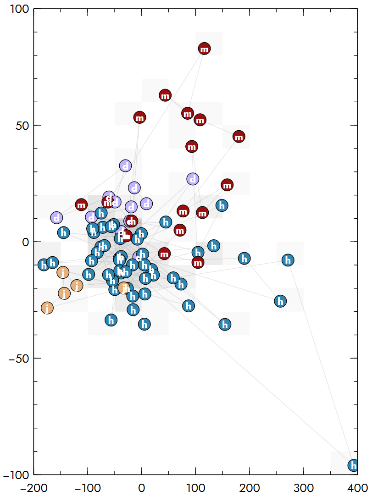

# Veusz Plugin: String Categorial to Numeric
A plugin for the scientific plotting package [Veusz](https://github.com/veusz/veusz) that helps transform categorial string data into numbers.

## Motivation
Imagine you have a dataset containing numerical `x` and `y` values for you to plot. You also have textual data `class` that further qualifies each data point. You may want to use `class` as the label within an xy-scatterplot. All perfect. Then you want to also have different colors for all the classes. There you hit a wall. The color selector only ingests numerical values.

## Usage
This plugin can be accessed via the Veusz menu under <samp>Data ⟩ Operations ⟩ Convert ⟩ String Categorial to Numeric</samp> lets you create a new list of values e.g. `class_nr` that assigns an increasing integer value to every newly encountered unique value within `class`. 

You can use this new `class_nr` in the color selector. Count the classes manually, then hit the <kbd>+</kbd> button in front of the color selector and choose a "Max val" of one less than the number of classes.

Finally within the "Formatting window" select the "Marker fill" tab and chose a fitting color map such as "seq".

## Installation
Save the file `string_categorial_to_numeric.py` from this repository somewhere on your drive. Use the Menu <samp>Edit ⟩ Preferences</samp> and open the "Plugins" tab. Add the file to the plugins list and restart Veusz.

Do not remove or rename the plugin file while it is still activated in the plugins list since that will prevent Veusz from starting.

## Feedback
Please feel free to use the issue tracker in this repo to provide any feedback.